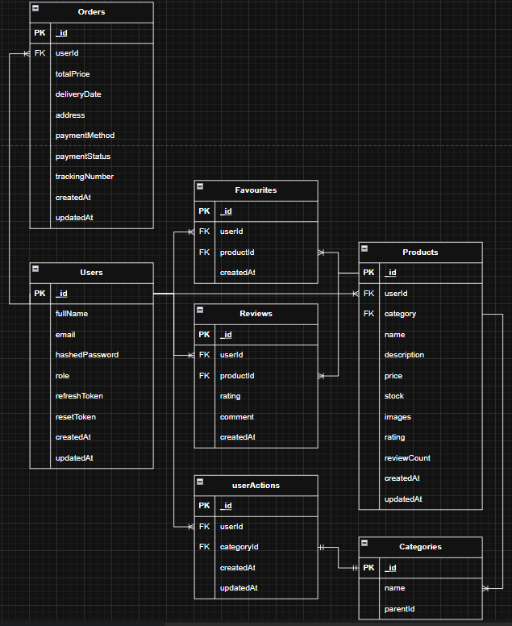
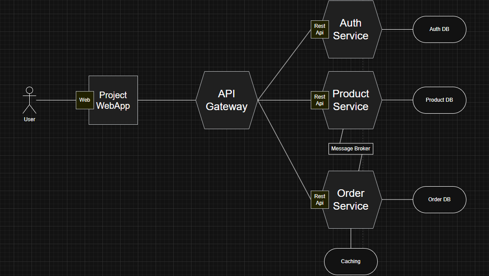

# Microservice Marketplace

### 📌 Описание проекта

Этот проект представляет собой маркетплейс, реализованный с использованием микросервисной архитектуры.
Система позволяет пользователям регистрироваться, просматривать товары, оформлять заказы и управлять своими учетными записями.

### 🏗️ Структура проекта

```sh
backend/
├── APIGateway/ # Гейтвей для маршрутизации запросов
├── AuthService/ # Сервис аутентификации пользователей
├── OrderService/ # Сервис управления заказами
├── ProductService/ # Сервис управления товарами
docker-compose.yml # Конфигурация для запуска микросервисов в Docker
```

### 🛠️ Используемые технологии

- Backend: Node.js, Express, MongoDB, Mongoose

- Frontend: React, TailwindCSS, DaisyUI

- Микросервисы: REST API, Docker, RabbitMQ (для асинхронного взаимодействия)

- Авторизация: JWT

- Инфраструктура: Docker, Kubernetes, CI/CD (GitHub Actions)

### 🚀 Запуск проекта

#### 1. Запуск без Docker (локально)

- Убедитесь, что у вас установлен Node.js.

- Клонируем репозиторий

```sh
git clone https://github.com/DenDOme/Market_Place_MERN.git
cd Market_Place_MERN
```

- Запуск каждого сервиса вручную

Перед запуском создайте файл `.env` в каждом сервисе, используя `.env.example`:

```sh
cd backend/APIGateway && npm install && npm run start
cd backend/AuthService && npm install && npm run start
cd backend/OrderService && npm install && npm run start
cd backend/ProductService && npm install && npm run start
```

#### 2. Запуск с Docker

- Если у вас установлен Docker, запустите:

```sh
docker-compose up --build
```

Это создаст и запустит все контейнеры.

### 3. Доступ к сервисам

API Gateway: http://localhost:4003

Auth Service: http://localhost:4000

Order Service: http://localhost:4001

Product Service: http://localhost:4002

### Диаграммы

- Диаграмма базы данных
  

- Диаграмма стркутуры проекта
  

### Документация каждого сервиса:

- [ApiGateway](./backend/APIGateway/doc.md) - документация по Api Gateway
- [AuthService](./backend/AuthService/doc.md) - документация по Auth Service
- [ProductService](./backend/ProductService/doc.md) - документация по Product Service
- [OrderService](./backend/OrderService/doc.md) - документация по Order Service
