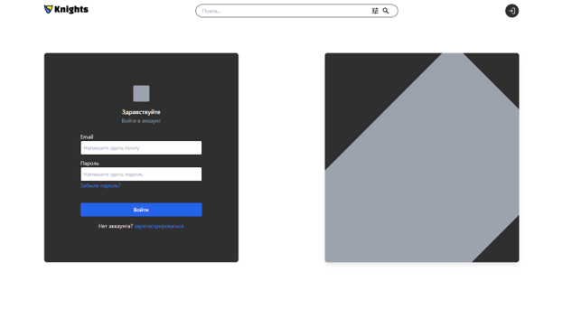
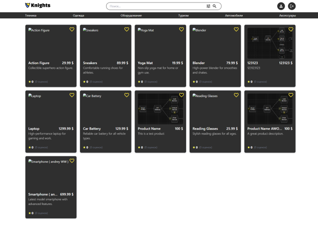
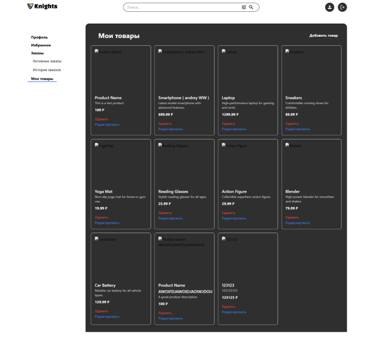
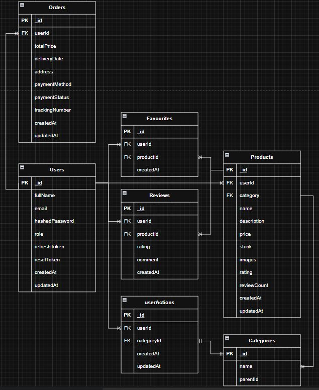
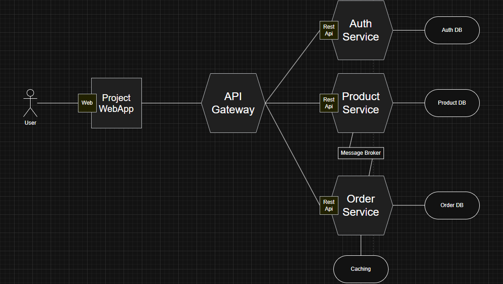

# 🛒 Microservice Marketplace — MERN Stack

[🇬🇧 English](#eng) | [🇷🇺 Русский](#ru)

# Eng

A full-stack marketplace application built with a **service-oriented architecture** as a diploma project. The backend is split into independent services communicating through an API Gateway and asynchronous messaging via RabbitMQ, containerized with Docker.

> **Note:** This project was built as a learning exercise in distributed system design patterns — service separation, async messaging, API gateway routing, and containerization. It is not production-ready but demonstrates real architectural thinking.

---

## 🚀 Live Demo

> _No live deployment yet — run locally with Docker (see below)_

---

## 📸 Screenshots

### Login Page

### Home Page

### Sellers products page


---

## 🏗️ Architecture

The backend is divided into 4 independent services:

```
backend/
├── APIGateway/      # Single entry point — routes all client requests
├── AuthService/     # User registration, login, JWT auth
├── ProductService/  # Product catalog management
├── OrderService/    # Order creation and management
frontend/            # React + TailwindCSS client
docker-compose.yml   # Spins up all services together
```

**Request flow:**

```
Client → API Gateway → AuthService / ProductService / OrderService
                    ↕ (async events via RabbitMQ)
```

---

## ⚙️ Tech Stack

### Backend
- **Node.js** + **Express.js** — REST API for each service
- **MongoDB** + **Mongoose** — data persistence
- **RabbitMQ** — asynchronous inter-service messaging
- **JWT** — stateless authentication
- **Helmet** + **express-rate-limit** — security hardening
- **Axios** — inter-service HTTP communication

### Frontend
- **React** — UI library
- **TailwindCSS** + **DaisyUI** — styling

### Infrastructure
- **Docker** + **Docker Compose** — containerization
- **GitHub Actions** — CI/CD pipeline

---

## 🔧 Running the Project

### Option 1 — Docker (recommended)

Make sure Docker is installed, then run:

```bash
git clone https://github.com/DenDOme/Market_Place_MERN.git
cd Market_Place_MERN
docker-compose up --build
```

All services will start automatically.

### Option 2 — Local (manual)

1. Clone the repo:
```bash
git clone https://github.com/DenDOme/Market_Place_MERN.git
cd Market_Place_MERN
```

2. Create a `.env` file in each service folder using the provided `.env.example`.

3. Start each service:
```bash
cd backend/APIGateway && npm install && npm run start
cd backend/AuthService && npm install && npm run start
cd backend/ProductService && npm install && npm run start
cd backend/OrderService && npm install && npm run start
```

### Service Ports

| Service | Port |
|---|---|
| API Gateway | `4003` |
| Auth Service | `4000` |
| Product Service | `4002` |
| Order Service | `4001` |
| Frontend | `5173` |

---

## 📡 API Gateway

All client requests go through the API Gateway at `http://localhost:4003`.

Route format:
```
http://localhost:4003/api/{serviceKey}/{path}
```

The gateway handles:
- Request routing to the correct service
- JWT authentication middleware
- Role-based access control
- Rate limiting (DDoS protection)
- CORS and security headers via Helmet

Full API docs per service:
- [API Gateway](./backend/APIGateway/doc.md)
- [Auth Service](./backend/AuthService/doc.md)
- [Product Service](./backend/ProductService/doc.md)
- [Order Service](./backend/OrderService/doc.md)

---

## 🗄️ Database Schema



---

## 🗂️ Project Structure Diagram



---

## 🔑 Environment Variables

Each service requires a `.env` file. Example variables:

```env
PORT=4000
MONGO_URI=mongodb://localhost:27017/auth
JWT_SECRET=your_jwt_secret
RABBITMQ_URL=amqp://localhost
```

See `.env.example` in each service folder for the full list.

---

## 📬 Contact

**Kerim Shen**
- GitHub: [@DenDOme](https://github.com/DenDOme)
- LinkedIn: [kerim-web](https://linkedin.com/in/kerim-web)
- Email: newlifeofkirim@gmail.com

- - -

# Ru

Full-stack приложение маркетплейса, построенное на **сервис-ориентированной архитектуре** в рамках дипломного проекта. Бэкенд разделён на независимые сервисы, взаимодействующие через API Gateway и асинхронную очередь сообщений RabbitMQ, всё контейнеризировано с помощью Docker.

> **Примечание:** Проект создан как учебное упражнение по паттернам распределённых систем — разделение сервисов, асинхронный обмен сообщениями, маршрутизация через API Gateway и контейнеризация. Не предназначен для продакшена, но демонстрирует реальное архитектурное мышление.

---

## 🚀 Демо

> _Живого деплоя пока нет — запустите локально через Docker (см. ниже)_

---

## 📸 Скриншоты


### Страница Авторизации

### Главная Страница

### Страница Мои Продукты


---

## 🏗️ Архитектура

Бэкенд разделён на 4 независимых сервиса:

```
backend/
├── APIGateway/      # Единая точка входа — маршрутизирует все запросы клиента
├── AuthService/     # Регистрация, вход, JWT авторизация
├── ProductService/  # Управление каталогом товаров
├── OrderService/    # Создание и управление заказами
frontend/            # React + TailwindCSS клиент
docker-compose.yml   # Запускает все сервисы вместе
```

**Поток запросов:**

```
Клиент → API Gateway → AuthService / ProductService / OrderService
                    ↕ (асинхронные события через RabbitMQ)
```

---

## ⚙️ Технологии

### Бэкенд
- **Node.js** + **Express.js** — REST API для каждого сервиса
- **MongoDB** + **Mongoose** — хранение данных
- **RabbitMQ** — асинхронный обмен сообщениями между сервисами
- **JWT** — stateless аутентификация
- **Helmet** + **express-rate-limit** — защита и безопасность
- **Axios** — HTTP взаимодействие между сервисами

### Фронтенд
- **React** — UI библиотека
- **TailwindCSS** + **DaisyUI** — стилизация

### Инфраструктура
- **Docker** + **Docker Compose** — контейнеризация
- **GitHub Actions** — CI/CD пайплайн

---

## 🔧 Запуск проекта

### Вариант 1 — Docker (рекомендуется)

Убедитесь, что Docker установлен, затем выполните:

```bash
git clone https://github.com/DenDOme/Market_Place_MERN.git
cd Market_Place_MERN
docker-compose up --build
```

Все сервисы запустятся автоматически.

### Вариант 2 — Локально (вручную)

1. Клонируйте репозиторий:
```bash
git clone https://github.com/DenDOme/Market_Place_MERN.git
cd Market_Place_MERN
```

2. Создайте файл `.env` в папке каждого сервиса на основе `.env.example`.

3. Запустите каждый сервис:
```bash
cd backend/APIGateway && npm install && npm run start
cd backend/AuthService && npm install && npm run start
cd backend/ProductService && npm install && npm run start
cd backend/OrderService && npm install && npm run start
```

### Порты сервисов

| Сервис | Порт |
|---|---|
| API Gateway | `4003` |
| Auth Service | `4000` |
| Product Service | `4002` |
| Order Service | `4001` |
| Frontend | `5173` |

---

## 📡 API Gateway

Все клиентские запросы проходят через API Gateway по адресу `http://localhost:4003`.

Формат маршрута:
```
http://localhost:4003/api/{serviceKey}/{path}
```

Gateway обеспечивает:
- Маршрутизацию запросов к нужному сервису
- Middleware для JWT аутентификации
- Ролевой контроль доступа
- Rate limiting (защита от DDoS)
- CORS и заголовки безопасности через Helmet

Полная документация по каждому сервису:
- [API Gateway](./backend/APIGateway/doc.md)
- [Auth Service](./backend/AuthService/doc.md)
- [Product Service](./backend/ProductService/doc.md)
- [Order Service](./backend/OrderService/doc.md)

---

## 🗄️ Схема базы данных


---

## 🗂️ Диаграмма структуры проекта


---

## 🔑 Переменные окружения

Каждый сервис требует файл `.env`. Пример переменных:

```env
PORT=4000
MONGO_URI=mongodb://localhost:27017/auth
JWT_SECRET=your_jwt_secret
RABBITMQ_URL=amqp://localhost
```

Полный список смотрите в `.env.example` в папке каждого сервиса.

---

## 📬 Контакты

**Керим Шен**
- GitHub: [@DenDOme](https://github.com/DenDOme)
- LinkedIn: [kerim-web](https://linkedin.com/in/kerim-web)
- Email: newlifeofkirim@gmail.com